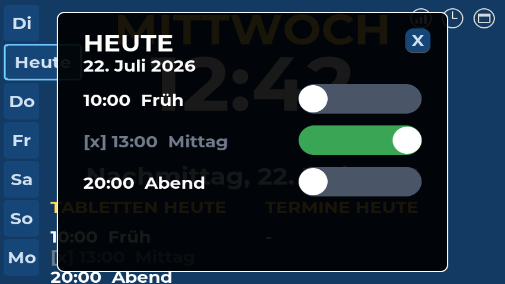

# Seniorenuhr

Eine Kalender-Uhr für hochbetagte Menschen, gebaut auf dem Waveshare
ESP32-S3-Touch-LCD-7 (7-Zoll-Touchdisplay, 800 × 480). Das Gerät steht dauerhaft
in der Wohnung und zeigt Wochentag, Uhrzeit, Datum sowie die heutigen Termine
und den Tablettenplan. Gepflegt wird alles aus der Ferne über einen gewöhnlichen
Kalender (Google Kalender oder Nextcloud) — am Gerät selbst muss niemand etwas
bedienen. Entstanden ist das Projekt für die eigenen Eltern.


*Die Hauptanzeige: links die antippbaren Wochentage, rechts oben die
Statussymbole für WLAN, Zeitsynchronisation und Kalenderabruf.*

## Funktionsweise

Termine und Tablettenzeiten werden in einem normalen Kalender gepflegt, der eine
private ICS-Abo-Adresse bereitstellt. Die Uhr lädt diesen Kalender alle
15 Minuten per HTTPS, parst die Einträge und hält sie in einem lokalen Cache —
fällt das Internet aus, zeigt sie die zuletzt bekannten Daten weiter an.

Tabletten sind gewöhnliche wiederkehrende Kalendereinträge mit dem Präfix
`TABLETTE:`. Die Uhr erkennt das Präfix, führt diese Einträge in einer eigenen
Liste und lässt sie per Fingertipp abhaken; der Abhak-Status wird lokal
gespeichert und übersteht auch einen Neustart.

Die Uhrzeit kommt per NTP (Zeitzone Europe/Berlin, Sommerzeit automatisch). Das
Board hat keine batteriegepufferte Echtzeituhr — nach einem Stromausfall holt
sich die Uhr die Zeit über das WLAN zurück.

## Gestaltung

Die Anzeige folgt Regeln, die sich bei Uhren für demente und hochbetagte
Menschen bewährt haben:

- Der ausgeschriebene Wochentag steht zuoberst — die häufigste Frage ist
  „Welcher Tag ist heute?"
- Die Tageszeit steht zusätzlich in Worten da („Vormittag", „Abend"), weil
  07:00 und 19:00 auf Digitaluhren leicht zu verwechseln sind
- Hoher Kontrast, keine Animationen, nichts blinkt
- Abends wird die Anzeige gedimmt, nachts ist der Hintergrund schwarz und die
  Terminliste ausgeblendet; eine Berührung schaltet für 30 Sekunden auf volle
  Helligkeit zurück
- Fällige Tabletten werden farblich hervorgehoben statt mit einem Alarmton

| Tagesansicht | Startbildschirm |
|---|---|
|  |  |
| *Der „Heute"-Dialog: jede Tablette wird mit einem breiten Schiebeschalter abgehakt.* | *Beim Start zeigen drei Ringe den Fortschritt: WLAN, Zeitabgleich, Kalenderabruf.* |

Weitere Bildschirmfotos, direkt vom Gerät aufgenommen, liegen unter
[docs/screenshots/](docs/screenshots/).

## Robustheit

Das Gerät läuft unbeaufsichtigt in einer anderen Wohnung. Die Grundregel dabei:
die Anzeige hat Vorrang vor allem anderen — lieber eine ungenaue Uhrzeit als ein
dunkler Bildschirm.

- Ohne WLAN oder Internet läuft die Anzeige mit den zuletzt bekannten Daten
  weiter; der Termin-Cache liegt auf einer eigenen Flash-Partition mit
  Wear-Levelling
- Bis zu fünf WLAN-Netze werden gespeichert; beim Start und nach
  Verbindungsverlust wählt ein Scan automatisch das gerade sichtbare aus
- Hängt beim Start eine Phase, erscheinen Ausweich-Buttons („WLAN wechseln",
  „Offline"); nach 60 Sekunden ohne Reaktion fährt das Gerät selbstständig
  offline fort, mit dem zuletzt angezeigten Zeitstand als Ausgangspunkt
- Ein Task-Watchdog startet das Gerät bei einem hängenden Prozess neu, statt
  eingefroren stehen zu bleiben
- Die Statussymbole rechts oben sind ehrlich: sie erscheinen durchgestrichen,
  wenn die Zeit nur manuell gesetzt wurde oder der Kalender nur aus dem Cache
  kommt

## Konfiguration

Alle Einstellungen sind ohne Neuflashen erreichbar: Das Zahnradsymbol auf dem
Startbildschirm öffnet ein Menü für WLAN (mit Netzwerk-Scan und
Bildschirmtastatur), Datum/Uhrzeit, die Kalender-Adresse und einen Demo-Modus
für Vorführungen ohne WLAN. Sobald das Gerät im WLAN ist, lässt sich die
Kalender-Adresse zusätzlich per Browser ändern — unter `http://seniorenuhr.local`
oder der IP-Adresse des Geräts.

## Hardware

| Komponente | Anmerkung |
|---|---|
| [Waveshare ESP32-S3-Touch-LCD-7](https://www.waveshare.com/wiki/ESP32-S3-Touch-LCD-7) | 7-Zoll-RGB-Display 800 × 480, kapazitiver Touch (GT911) |
| Flash/PSRAM | 8 MB / 8 MB (N8R8) — die Produktseite nennt 16 MB Flash, verbaut sind 8 |
| Netzteil | USB-C, mindestens 2 A, Dauerbetrieb |

Der microSD-Slot bleibt ungenutzt; alles Persistente liegt im internen Flash.
Eine falsch konfigurierte Flash-Größe führt zu einer Assert-Schleife beim Boot —
`sdkconfig.defaults` ist bereits auf die tatsächlichen 8 MB eingestellt.

## Aufbau der Firmware

Die Firmware basiert auf ESP-IDF 5.5 und LVGL 9 (über esp_lvgl_port). Die Module
liegen als flache C-Dateien in `main/` — je eines für Display-Ansteuerung,
WLAN, Zeit, Kalender-Download, Cache, Anzeige-Logik, Einrichtungsbildschirme und
Web-Konfiguration. Zwei Aufgaben laufen strikt getrennt: die LVGL-Task
aktualisiert die Anzeige im Sekundentakt, eine eigene Kalender-Task erledigt
Download und Parsen — Netzwerkprobleme können die Anzeige dadurch nie ins
Stocken bringen.

Der ICS-Parser ist als portable Komponente (`components/kalender`) geschrieben
und läuft unverändert auch auf dem PC, wo ihn eine Testsuite mit 25 Prüfungen
abdeckt (`test_host/`). Die Schriften sind selbst generierte LVGL-Fonts auf
Basis von Montserrat, da die in LVGL eingebauten Fonts keine deutschen Umlaute
enthalten.

Die ausführliche Dokumentation liegt im Repository:

- [FAHRPLAN.md](FAHRPLAN.md) — Architektur, Entwurfsentscheidungen und die
  komplette Entwicklungsgeschichte
- [ENTWICKLUNG.md](ENTWICKLUNG.md) — Entwicklungsumgebung und tägliche Befehle
- [FALLSTRICKE_UND_WORKAROUNDS.md](FALLSTRICKE_UND_WORKAROUNDS.md) — zwanzig
  gelöste Probleme mit Ursache und Lösung, vom Flash-Größen-Assert bis zu
  LVGL-Speicherlecks

## Bauen und Flashen

Vorausgesetzt wird [ESP-IDF v5.5](https://docs.espressif.com/projects/esp-idf/en/v5.5/esp32s3/get-started/index.html);
gebaut wird mit dessen Werkzeug `idf.py`. Alle Fremdkomponenten (LVGL,
esp_lvgl_port, GT911-Treiber) lädt der ESP-IDF-Komponentenmanager beim ersten
Build automatisch.

```
git clone https://github.com/peterm2024/seniorenuhr.git
cd seniorenuhr
```

Die Zugangsdaten liegen in einer nicht versionierten Datei, die aus der Vorlage
angelegt wird:

```
copy main\secrets.example.h main\secrets.h
```

In `main/secrets.h` WLAN-Name, WLAN-Passwort und die private ICS-Adresse des
Kalenders eintragen. WLAN und Kalender-Adresse lassen sich später auch am
laufenden Gerät ändern.

Dann bauen und flashen — die ESP-IDF-Umgebung muss in der Sitzung aktiviert
sein, der serielle Port (hier `COM3`) steht im Geräte-Manager:

```
idf.py build
idf.py -p COM3 flash
idf.py -p COM3 monitor
```

Der Monitor zeigt das Boot-Log und wird mit `Strg+]` beendet. Bei Problemen
lohnt der Blick in [FALLSTRICKE_UND_WORKAROUNDS.md](FALLSTRICKE_UND_WORKAROUNDS.md),
bevor etwas erneut untersucht wird, das schon einmal gelöst wurde.

## Kein Medizinprodukt, keine Garantie

Dieses Projekt ist ein privates Hobbyprojekt — eine Kalender-Uhr mit
Erinnerungsanzeige. Es ist kein Medizinprodukt im Sinne der
EU-Medizinprodukteverordnung (MDR), hat keine medizinische Zweckbestimmung und
ersetzt weder Pflege noch ärztliche Betreuung noch geprüfte
Medikamenten-Erinnerungssysteme.

Die Anzeige kann jederzeit ausfallen (Stromausfall, WLAN-Störung, Softwarefehler
o. Ä.). Verlasst euch bei kritischen Medikamenten niemals allein auf dieses
Gerät — sichert die Einnahme immer zusätzlich ab, etwa durch Dosierbox, Anruf
oder Pflegedienst.

Die Nutzung erfolgt auf eigene Gefahr. Gewährleistung und Haftung sind im
rechtlich zulässigen Umfang ausgeschlossen (siehe Abschnitte 15–17 der
GPLv3-Lizenz).

## Lizenz

Der Quellcode dieses Projekts steht unter der GNU General Public License v3
(siehe [LICENSE](LICENSE)): Jeder darf ihn frei nutzen, verändern und
weitergeben — wer ihn aber, auch verändert oder in Geräten, weitergibt, muss den
Quellcode unter denselben Bedingungen offenlegen. Copyright © 2026 peterm2024.

Ausnahme: die Schriftdateien in `assets/fonts/` sind aus der Schrift
[Montserrat](https://github.com/JulietaUla/Montserrat) generiert und stehen
unter der SIL Open Font License 1.1
(siehe [assets/fonts/LICENSE-OFL.txt](assets/fonts/LICENSE-OFL.txt)).

Fremdkomponenten (ESP-IDF, LVGL, esp_lvgl_port, GT911-Touchtreiber) sind nicht
Teil dieses Repositories, sondern werden beim Bauen über den
ESP-IDF-Komponentenmanager bezogen; sie stehen unter ihren eigenen permissiven
Lizenzen (Apache 2.0 bzw. MIT).
